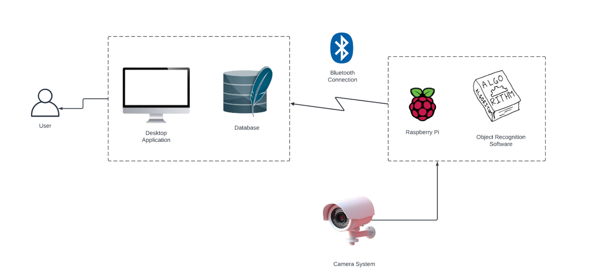

#  Stockasaurus Rex

Stockasaurus Rex addresses the challenge of stock shortages specifically within the food and beverage industries. Developed to seamlessly manage inventory, this solution ensures businesses never disappoint customers with out-of-stock items. By accurately detecting storage times and estimating expiry dates, Stockasaurus Rex enables proactive stock management, reducing food waste and optimizing inventory levels.

Development Timeline: April 22, 2024 - June 21, 2024.

## The-Shelf-Scanners (The Team)

Josephine Stensgaard

Jordana Guilbride Capela

Daffa Rizky Ananda

Sàra Bubànovà

Bocheng Peng 

Anastasia Lukanova

## Features

- Automated inventory management
- Clear overview of all refrigerator products
- Real-time detection og product additions and removals.
- Expiry date tracking and alerts 

## Feedback

If you have any feedback, please reach out to the project leader at jordana.guilbride.capela@student.nhlstenden.com 

